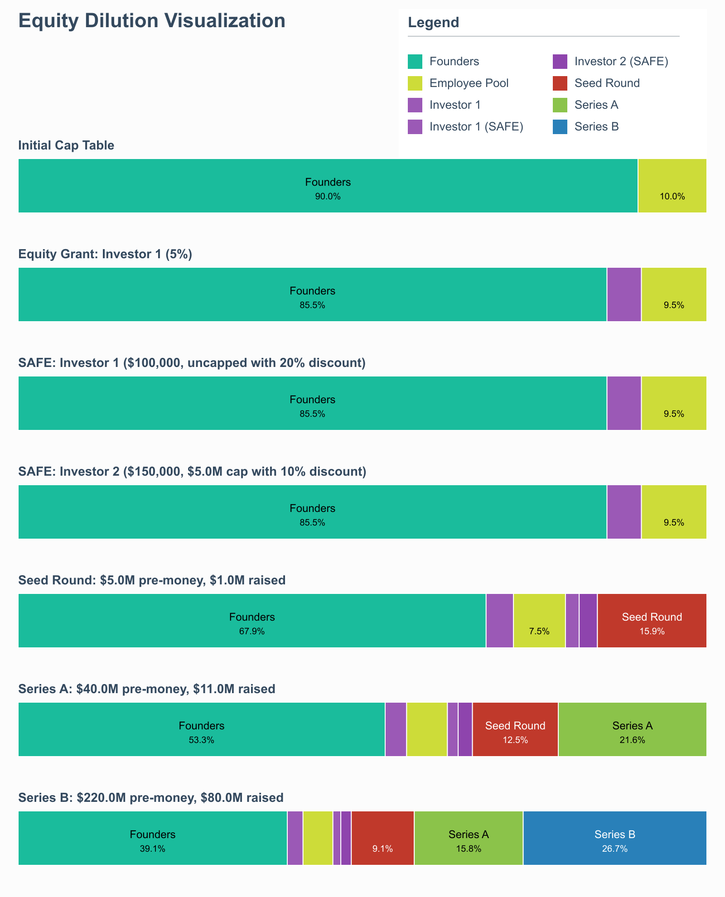

<div align="center">
  <h1>SAFE Cap Table Simulator</h1>
  <p>A powerful, visual tool for simulating startup equity dilution with support for modern financing instruments.</p>
  
</div>

## 🚀 Features

- **SAFE Support**: Full modeling of both pre-money and post-money SAFEs with caps, discounts
- **Visual Dilution Tracking**: Generate beautiful visualizations of equity dilution over time
- **High-Resolution Output**: Create presentation-ready cap table visuals
- **Typed API**: Fully TypeScript implementation with strong typing
- **Founder-Friendly**: Easy to understand how different financing scenarios impact founder equity

## 📊 Example

This example shows how equity changes through different fundraising events:

```typescript
// Create a new company with founders and an option pool
const company = new Company({
  founders: [
    { name: 'Founder1', ownership: 45 }, 
    { name: 'Founder2', ownership: 45 }
  ],
  pools: [
    { note: 'Employee Equity Pool', ownership: 10 }
  ]
});

// Simulate equity events
company
  .giveEquity(5, 'Techstars')                             // Give 5% to accelerator
  .signSafe('uncapped', 100_000, 'Techstars', 20)         // Uncapped SAFE with 20% discount
  .signSafe(5_000_000, 150_000, 'Investor 1', undefined, 'pre-money') // Pre-money SAFE with $5M cap
  .signSafe(4_500_000, 200_000, 'Investor 2', 10, 'post-money') // Post-money SAFE with $4.5M cap and 10% discount
  .pricedRound(5_000_000, 1_000_000, 'Seed Round')        // Seed round at $5M pre-money valuation
  .logEquity()                                            // Print cap table to console
  .plot('equity-dilution.png');                           // Generate visualization
```

## 🧮 Understanding SAFEs

This simulator supports modern SAFE (Simple Agreement for Future Equity) agreements:

- **Pre-money SAFEs**: The older style where conversion happens based on pre-money valuation
- **Post-money SAFEs**: The newer YC-style where conversion happens based on post-money valuation
- **Uncapped SAFEs**: Converts based on the round price (with optional discount)
- **Capped SAFEs**: Converts based on the lower of cap price or round price (with optional discount)

The simulator handles all SAFE conversion calculations automatically when a priced round occurs.

## 📈 API Reference

### Creating a Company

```typescript
const company = new Company({
  founders: [
    { name: 'Founder1', ownership: 50 },
    { name: 'Founder2', ownership: 40 }
  ],
  pools: [
    { note: 'Option Pool', ownership: 10 }
  ]
}, 1_000_000); // Optional: initial share count
```

### Methods

| Method | Description |
|--------|-------------|
| `giveEquity(percent, name, type?)` | Issue equity equal to specified percent (post-issuance) |
| `signSafe(cap, amount, name, discount?, type?)` | Sign a SAFE with investor |
| `pricedRound(preMoneyValuation, amount, name?)` | Execute a priced financing round |
| `logEquity()` | Log current cap table to console |
| `plot(outputPath?, width?)` | Generate visual equity dilution diagram |

## 📚 Reference Links

- [YC Post-Money SAFE Documents](https://www.ycombinator.com/documents/)
- [YC Safe Explanation YT video](https://youtu.be/Dk6JNTDec9I?si=c4j0K4cdOGLXmAnr)

## 🤝 Contributing

Pull requests are welcome! This is an open-source tool to help founders better understand dilution.

## 📝 License

Apache License 2.0 - see the [LICENSE](./LICENSE) file for details.